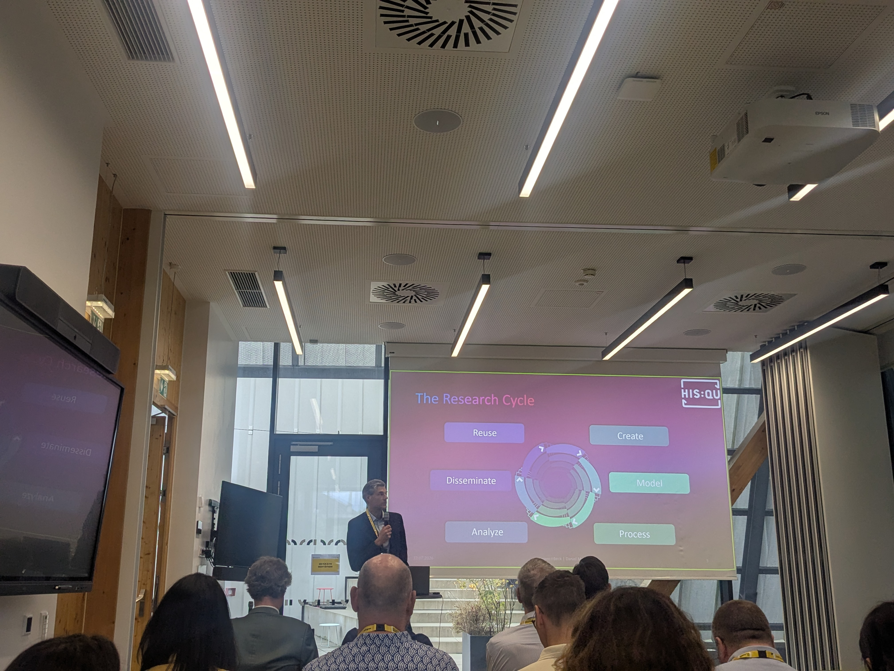

# HisQu auf der CID-DiDip-Konferenz 2026 in Graz

Vom 22. bis 24. Juli 2026 fand an der Universität Graz die gemeinsame Konferenz der Commission internationale de diplomatique (CID) und des Netzwerks *Digital Diplomatics* (DiDip) statt. Unter dem Titel **„The Methodology of Diplomatics“** diskutierte die Tagung, wie sich die Methoden der Diplomatik entwickelt haben, welche Ansätze sich für unterschiedliche Quellen und Fragestellungen eignen und wie digitale Verfahren das Fach verändern. Anlass war der 200. Geburtstag des Diplomatikers Theodor Sickel.

Wir waren mit einem Beitrag von Clemens Beck und Daniel Motz vertreten. In unserem Vortrag **„Wie modelliert man Diplomatik? Ontologische Formalisierung und Reasoning im Projekt HisQu“** stellten wir den in HisQu entwickelten Forschungsdatenzyklus vor und diskutierten, wie sich diplomatische Interpretationen in einer ontologiebasierten Wissensbasis abbilden lassen.

## Von digitalisierten Quellen zu digitalen Arbeitsprozessen
Ausgangspunkt unseres Vortrags war die Beobachtung, dass die Digitalisierung historischer Quellen nicht automatisch zu digitalen Forschungsprozessen führt. Auch digital zugängliche Bücher, Editionen oder Datenbanken werden häufig weiterhin auf klassische Weise gelesen, exzerpiert und interpretiert. Die dabei getroffenen Entscheidungen bleiben meist implizit und lassen sich später nur eingeschränkt nachvollziehen.

In HisQu versuchen wir deshalb, die einzelnen Arbeitsschritte von der Digitalisierung und Aufbereitung der Quellen über ihre Modellierung und Verarbeitung bis hin zur Analyse, Veröffentlichung und Nachnutzung in einem geschlossenen Forschungsdatenzyklus miteinander zu verbinden. Dabei geht es uns nicht allein um die technische Verarbeitung großer Quellenbestände. Ebenso wichtig ist die Frage, wie wir die fachwissenschaftlichen Entscheidungen dokumentieren können, auf denen unsere Daten beruhen.

Am Beispiel des Repertorium Germanicum zeigten wir, welche Herausforderungen sich dabei ergeben. Die stark abgekürzten lateinischen Regesten sind zwar seriell aufgebaut und durch wiederkehrende Formeln geprägt. Ihre Interpretation setzt jedoch umfangreiches Wissen über die päpstliche Kanzlei, das spätmittelalterliche Kirchenrecht und die Struktur kirchlicher Ämter und Institutionen voraus.

## Diplomatische Interpretation als Teil des Datenmodells
Im Mittelpunkt unseres Beitrags stand daher die Frage, wie wir dieses Fachwissen explizit modellieren können. Wann verstehen wir einen beschriebenen Vorgang als Provision, Supplik oder Dispensation? Unter welchen Bedingungen können wir aus der Nennung eines Benefiziums auf einen Anspruch oder eine Amtsinhaberschaft schließen? Und wie unterscheiden wir zwischen dem, was ausdrücklich im Regest steht, und dem, was wir aufgrund diplomatischer und kirchenrechtlicher Kenntnisse daraus ableiten?

Nennt ein Regest beispielsweise eine päpstliche Provision für ein Benefizium, lässt sich zunächst feststellen, dass ein bestimmter Rechtsakt überliefert ist. Für die historische Auswertung reicht diese Feststellung jedoch nicht aus. Die Provision bezieht sich auf ein konkretes kirchliches Amt, steht in einem institutionellen Zusammenhang und besitzt eine zeitliche und rechtliche Reichweite. Je nach Kontext kann sie eine tatsächliche Amtsinhaberschaft, einen Anspruch auf ein Amt oder lediglich einen bestimmten Stand innerhalb eines Verfahrens belegen.

Mit unserer Ontologie versuchen wir, solche Zusammenhänge ausdrücklich abzubilden. Wir modellieren deshalb nicht nur Personen, Orte und Institutionen, sondern auch Ereignisse, Zustände, Quellenstellen und einzelne Behauptungen. Dadurch können wir zwischen der Quelle, der darin enthaltenen Aussage und der historischen Entität unterscheiden, auf die sich diese Aussage bezieht. Zugleich bleibt nachvollziehbar, wie eine Information in unsere Wissensbasis gelangt ist.

## Regeln, Widersprüche und mögliche Schlussfolgerungen
Ein weiterer Schwerpunkt des Vortrags lag auf der Frage, wie sich fachwissenschaftliche Regeln für die Validierung und Auswertung der Daten nutzen lassen. Solche Regeln können etwa zeitliche Widersprüche sichtbar machen: Wenn eine Person laut einer Aussage bereits verstorben war, nach einer anderen Quelle aber Jahre später einen Rechtsakt vollzogen haben soll, können nicht beide Aussagen ohne Weiteres dieselbe historische Person betreffen. Möglicherweise ist eine der Aussagen fehlerhaft oder unsicher; möglicherweise haben wir es mit zwei verschiedenen Personen gleichen oder ähnlichen Namens zu tun.

Indem wir solche Annahmen als maschinenlesbare Regeln formulieren, können wir Widersprüche systematisch erkennen und den Forschenden zur Prüfung vorlegen. Die Regeln entscheiden dabei nicht selbstständig, welche historische Interpretation richtig ist. Sie machen vielmehr sichtbar, an welchen Stellen Klärungsbedarf besteht und auf welchen Annahmen eine mögliche Schlussfolgerung beruht.

Dasselbe gilt für automatische Ableitungen. Aus bestimmten Quelleninformationen lassen sich mit Hilfe diplomatischer oder kirchenrechtlicher Regeln weitere Aussagen erschließen. Diese müssen in der Wissensbasis jedoch anders behandelt werden als ausdrücklich belegte Informationen. Für uns ist daher entscheidend, dass erkennbar bleibt, ob eine Aussage unmittelbar aus einer Quelle stammt, durch ein Sprachmodell extrahiert, anhand einer Regel abgeleitet oder fachwissenschaftlich geprüft wurde.

## KI als Bestandteil einer nachvollziehbaren Infrastruktur
Auch der Einsatz von Large Language Models wurde in diesem Zusammenhang thematisiert. In unserem Workflow unterstützen sie unter anderem die Nachkorrektur der OCR und die Extraktion von Informationen aus den Regesten. Sie arbeiten jedoch innerhalb eines Rahmens, der durch die Ontologie, den Bezug zu konkreten Quellenstellen und zusätzliche Validierungsregeln vorgegeben wird.

Jede extrahierte Aussage soll auf eine Passage im Regest zurückgeführt werden können. Gleichzeitig dokumentieren wir, durch welchen Verarbeitungsschritt und auf Grundlage welcher Modellierungsentscheidung sie entstanden ist. KI verstehen wir damit nicht als eigenständige Interpretationsinstanz, sondern als Bestandteil einer kontrollierbaren Forschungsinfrastruktur.

Unser Beitrag in Graz sollte zeigen, dass digitale Diplomatik über die Bereitstellung digitaler Editionen und Suchoberflächen hinausgehen kann. Wenn wir Quellen, Aussagen, fachwissenschaftliche Interpretationen und Verarbeitungsschritte gemeinsam modellieren, werden diplomatische Methoden selbst zum Gegenstand der digitalen Formalisierung. Ontologien und Reasoning ersetzen dabei nicht das Urteil der Fachwissenschaft. Sie helfen uns vielmehr, dieses Urteil explizit, überprüfbar und nachnutzbar zu machen.
