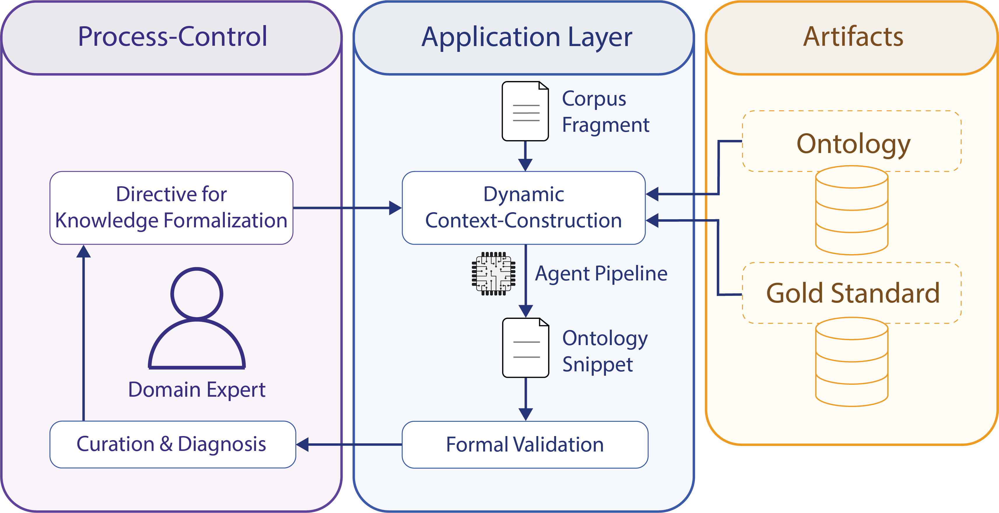

Das *Repertorium Germanicum* (RG) verzeichnet über 160.000 Einträge zur mittelalterlichen vatikanischen Überlieferung. Es steckt voller strukturierten Wissens -- nur ist dieses Wissen nirgends explizit gemacht. Die Regesten folgen erkennbaren Konventionen, doch ein formales Datenmodell, das Maschinen lesen könnten, existiert nicht. Genau hier setzt unser Datamodel-Workflow an: Er überführt das implizite Modellwissen der Historiker:innen Schritt für Schritt in eine formale Ontologie -- mit Sprachmodellen als Werkzeug, aber unter fachwissenschaftlicher Kontrolle.

## Warum es nicht ohne Menschen geht

Frühere Arbeiten im Projekt haben gezeigt, dass Named Entity Recognition Personen, Orte und Institutionen an der Textoberfläche zuverlässig findet. Für die eigentliche historische Fragestellung reicht das aber nicht. Wer wissen will, warum eine Pfründe frei wurde, wer sie vergeben hat und in welchem rechtlichen Verhältnis zwei Vorgänge zueinander stehen, braucht ein ereigniszentriertes Modell -- eines, das kirchenrechtliche Vorgänge wie Vakanz, Provision, Dispens oder Kollation als eigenständige Entitäten fasst und zueinander in Beziehung setzt.

Der Aufbau eines solchen Modells steckt in einem Dilemma. Eine domänenspezifische Ontologie für ein Korpus dieser Größe von Hand zu bauen, ist extrem ressourcenintensiv. Vollautomatische Verfahren mit Large Language Models scheitern dagegen an der nötigen semantischen Präzision: Sie erzeugen inzwischen zwar meist syntaktisch fehlerfreies OWL oder RDF, aber ob die formale Repräsentation tatsächlich die gemeinte historische Wirklichkeit abbildet, bleibt offen. Hinzu kommen Halluzinationen und schwankende Ergebnisse.

Unser Workflow kombiniert deshalb beide Seiten: LLMs senken die technische Hürde der Formalisierung, die semantische Kontrolle bleibt bei den Fachwissenschaftler:innen.

## Der Workflow in vier Schritten

**Ausgangspunkt** ist jeweils eine *Petentenvita* -- im RG die kleinste sinnvolle Einheit: ein Kopf mit den Angaben zu einer Person und die darunter versammelten Regesten zu ihren Vorgängen. Dazu kommen zwei weitere Eingaben: die **Historiker:innen-Vorgaben**, in denen die Fachexpert:innen in natürlicher Sprache beschreiben, welche Entitäten, Relationen und impliziten Zusammenhänge erfasst werden sollen, und ein Ausschnitt der **Referenzontologie**, also des bisherigen Modellierungsstands.

**Stufe 1 -- der Planungsagent.** Ein Sprachmodell in der Rolle eines Planungsagenten erzeugt daraus keinen Code, sondern einen *Modellierungsplan* in Markdown. Er beschreibt, welche Sicht auf die Petentenvita modelliert wird, welche Entitäten, Ereignisse, Rollen, Orte, Zeitangaben und Quellenbezüge zu erfassen sind und welche Begriffe dafür verwendet werden sollen. Dazu kommt eine Evidenzliste, die jede Aussage an eine konkrete Textstelle zurückbindet.

**Stufe 2 -- der Kodierungsagent.** Erst im zweiten Schritt wird derselbe Plan in Turtle übersetzt. Ergebnis ist eine einzige TTL-Datei mit festen Prefix-Definitionen, einem terminologischen Teil (TBox: Klassen und Properties) und einem Instanzteil (ABox: die konkreten Individuen dieser Petentenvita). Alle verwendeten Klassen werden mitdeklariert, auch bereits bekannte -- so bleibt das Fragment selbsttragend und unabhängig prüfbar.

Die Trennung ist der methodische Kern: Modellierungs*entscheidung* und syntaktische *Implementierung* werden bewusst auseinandergezogen. Der Freiheitsgrad des Modells wird dadurch in beiden Schritten deutlich kleiner -- und Fehler werden dort sichtbar, wo sie entstehen.

**Stufe 3 -- die Validierung.** Sie erfolgt vollständig manuell. Historiker:innen prüfen Plan und TTL-Fragment als aufeinander bezogene Artefakte: Sind die relevanten Sachverhalte vollständig erfasst? Sind die Aussagen am Text nachvollziehbar? Sind neue Klassen wirklich nötig? Ein eigener Prüfpunkt gilt dem Inferenzstatus -- der Frage, was direkt im Regest steht und was fachlich plausibel ergänzt wurde. Formale Prüfung findet bislang vor allem als Syntaxcheck beim Laden in Protégé statt.

**Stufe 4 -- Integration und Iteration.** Nach bestandener Prüfung wird das Fragment in die Gesamtontologie integriert; Konflikte lösen Expert:innen vor dem Merge auf. Die Fortschreibung erfolgt versioniert im GitHub-Projekt nach Semantic Versioning, sodass TBox-Stand, ABox-Beispiele und Modellierungskontext an dieselbe Versionslogik gebunden bleiben. Validierte ABox-Einträge werden damit zugleich zu Few-Shot-Beispielen für spätere Durchläufe -- ausgewählt über einen FAISS-Vektorindex, dessen kleinste Vergleichseinheit ein Kopf-Regest-Paar ist, also genau ein Vorgang im Kontext seiner Person.

Wichtig dabei: Der Workflow setzt keinen fertigen Anforderungskatalog voraus. Er wächst top-down aus den Forschungsinteressen der Fachcommunity und bottom-up aus der Modellierung einzelner Regesten.

## Ein Beispiel: Hiddo Ludolphi Boetama

Wie das konkret aussieht, zeigt ein Feldversuch an der Petentenvita RG III 1010:

> Hiddo Ludolphi Boetama (Bottania) de Coldem monach. mon. s. Nicolai in Hemelis o. s. Ben. Traiect. dioc. bac. in decr. m. prov. super prepos. eiusdem mon. vac. per ob. Ricardi Zibiandi de Warbicze 9 iun. 1414 L 176 164. m. prov. super par. eccl. de Midlucze Traiect. dioc. vac. per suum ingr. in d. mon., cum disp. retin. par. eccl. cum prepos. dicti mon. ad 5 an. 5 iul. 1414 L 176 158v.

Hiddo ist Mönch des Benediktinerklosters St. Nikolai in Hemelis (Diözese Utrecht) und Baccalarius des Kirchenrechts. Zwei Vorgänge sind verzeichnet: ein Provisionsmandat über die Propstei desselben Klosters, vakant durch den Tod des Vorgängers, und ein zweites über eine Pfarrkirche in Midlucze, die durch Hiddos *eigenen* Klostereintritt frei geworden war -- dazu eine Dispens, beide Pfründen fünf Jahre lang zu behalten.

Das Ergebnis war aufschlussreich, gerade in seinen Fehlern. Die kausale Verknüpfung -- Hiddos Eintritt als Vakanzgrund -- bildete das Modell relational korrekt ab, ebenso die Koreferenz von *d. mon.* auf die richtige Kloster-IRI. Gleichzeitig legte der Durchlauf Schwächen der Bestandsontologie offen:

- *monach.* wurde über `hat_kirchlichen_Stand` verknüpft, eine Property, die für Kleriker und Laien reserviert ist; korrekt wäre `hat_kirchliches_Amt`.
- Bei der Dispens zeigte sich, dass für denselben Sachverhalt zwei Klassen existieren -- `Pfründenhäufung` und `Pfründe_behalten` -- eine Redundanz, die vorher nicht aufgefallen war.
- Bei der Modellierung des Mandats musste das System auf eine Doppeltypisierung ausweichen, weil `Mandat` in der Ontologie als Unterklasse von `Objekt` geführt wird, inhaltlich aber ein Beauftragungsakt und damit eine Aktivität ist.

Genau darin liegt der eigentliche Wert des Verfahrens: Jeder Durchlauf ist zugleich ein Prüfprotokoll für den aktuellen Ontologiestand. Das Sprachmodell macht Inkonsistenzen sichtbar, die in der händischen Modellierung lange unentdeckt bleiben würden.

## Was als Nächstes ansteht

Die empirische Basis ist bislang schmal -- eine Petentenvita, ein Modell, ein Ontologiestand. Aussagen zu Ergebnisvarianz, Reproduzierbarkeit und Skalierbarkeit über verschiedene Bände und Falltypen hinweg stehen noch aus. Im Zentrum der weiteren Arbeit steht die Stabilisierung der Kernontologie, insbesondere eine saubere Trennung zwischen quellenbezogenen und interpretativ erschlossenen Aussagen. Provisorische Sammelkategorien wie `Objekt` müssen dabei nach und nach in klarer abgegrenzte Unterklassen überführt werden.

Das langfristige Ziel bleibt ein versionierter, fachlich kuratierter Knowledge Graph, der Personen, Institutionen, Orte, Rollen, Ereignisse und Quellenzusammenhänge des RG systematisch erschließt -- und bandübergreifende Analysen möglich macht, die bisher an der Verdichtung der Quelle scheitern.
