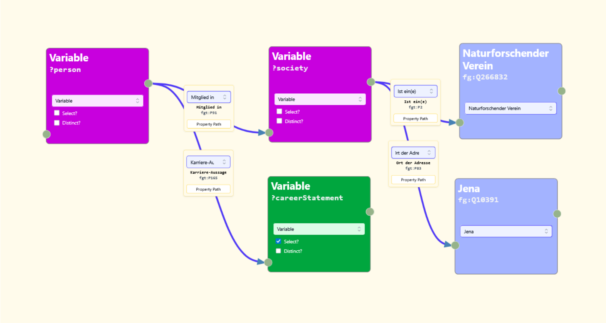

Wissensgraphen sind eine vielsversprechende Technologie zur Aggregation diverser Datenquellen, unter anderme in den Geschichtswissenschaften. Die Syntax der Abfragesprache SPARQL ist jedoch komplex. Unser Ansatz, _Query by Graph_, ermöglicht das Entwerfen einfacher SPARQL-Abfragen über eine graphische Benutzeroberfläche. Mit Mausklicks und einer Suchfunktion können Abfragen erstellt werden, ohne eine Zeile "Code" zu schreiben.

## Potentiale von Wikibase und Wissensgraphen
Query by Graph wurde speziell für die Plattform Wikibase entwickelt. Wikibase-Instanzen mit großen Nutzerbasen sind zum Beispiel [Wikidata](https://www.wikidata.org/) und, vor allem in den Geschichtswissenschaften, [FactGrid](https://database.factgrid.de/wiki/Main_Page). Wikibase-Systeme bieten einerseits eine graphische Oberfläche zur Einsicht und Bearbeitung von Einträgen, die denen einer Enzyklopädie nachempfunden sind. Bei Abruf des Eintrags zu Johann Wolfgang von Goethe, erscheinen Lebensdaten, Werke, Portraits, Nackommen und viel mehr. Die, im Vergleich zu etwa Wikipedia oder einer Print-Enzyklopädie, ist, dass diese Daten auch in Form eines Wissensgraphs zugänglich sind. Dies ermöglicht das Formulieren und Beantworten von Fragen, die über einen Enzyklopädieeintrag hinausgehen, etwa "An welchen Orten hielten sich Goethe und Schiller gleichzeitig auf?" oder "Welche Personen hielten sich von 1400 bis 1500" in Metz auf?" Damit können Fragen, die sonst aufwändige Recherchen erfordern, innerhalb weniger Minuten beantwortet werden -- gegeben die Informationen sind im Wissensgraph erfasst.

## Query by Graph

Unser Tool ermöglicht es eine Teilmenge der potentiell im Formalismus vorgesehenen Abfragen zu schreiben; mit diesen können jedoch bereits einige interessante Fragestellungen bearbeitet werden.

**Beispiel:**


Nachfolgend sehen Sie die natürlichsprachliche Repräsentation der Frage, Ansicht von Query by Graph und die daraus von Query by Graph generierte SPARQL-Abfrage.

**Welche Berufe hatten Personen, die in Naturforschervereinen in Jena Mitglied waren?**


```sparql
PREFIX fg: <https://database.factgrid.de/entity/>
PREFIX fgt: <https://database.factgrid.de/prop/direct/>

SELECT ?careerStatement ?careerStatementLabel WHERE {
    ?person fgt:P91 ?society .
    # Variable -- [Mitglied in] -> Variable
    ?person fgt:P165 ?careerStatement .
    # Variable -- [Karriere-Aussage] -> Variable
    ?society fgt:P2 fg:Q266832 .
    # Variable -- [Ist ein(e)] -> Naturforschender Verein
    ?society fgt:P83 fg:Q10391 .
    # Variable -- [Ort der Adresse] -> Jena
    SERVICE wikibase:label { bd:serviceParam wikibase:language "[AUTO_LANGUAGE],en". }
}
```